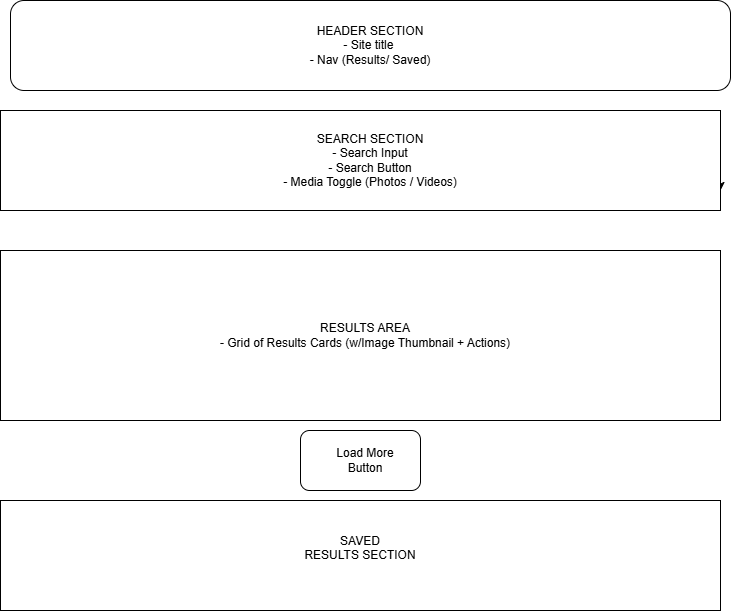
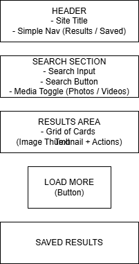

# My Name

- Lee Samuel

# Project Name

- Media-Explorer

# Project2 - Media Explorer

Media Explorer is a single-page web application that allows users to search for photos and short videos using the Pexels API. Search results update dynamically without page reloads, and users can save favorite items for later viewing.

## View Online

- https://lsamuel1962-bot.github.io/Project2-Media-Explorer/
- This project can be run locally using VS Code Live Server.
- An API key from Pexels is required for local testing.

## User Stories

### As a user searching for media

- I want to search for photos or videos by keyword
- So that I can quickly discover relevant media

**Acceptance Criteria**

- Given I enter a keyword
- When I submit the search
- Then I see dynamically loaded results without a page refresh

### As a user browsing results

- I want to toggle between photos and videos
- So that I can control the type of media displayed

### As a user saving content

- I want to save items I like
- So that I can view them again later

## Wireframes

**Desktop View**

**Mobile View**

Because Media Explorer is a single-page application with dynamic results, one desktop and one mobile wireframe were created to demonstrate responsive layout and user flow.

## Technologies Used

- HTML5
- CSS3
- SCSS (CSS Preprocessor)
- JavaScript (functions, async/await, fetch API)
- Pexels API
- Git & GitHub

## Ideas for Improvement

- Add pagination indicators
- Allow filtering by orientation or color
- Add user accounts for saved items
